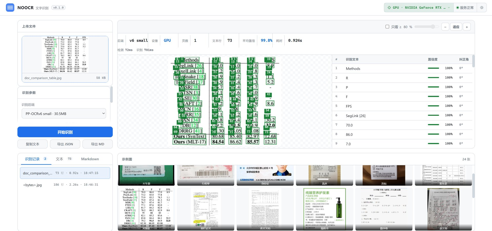
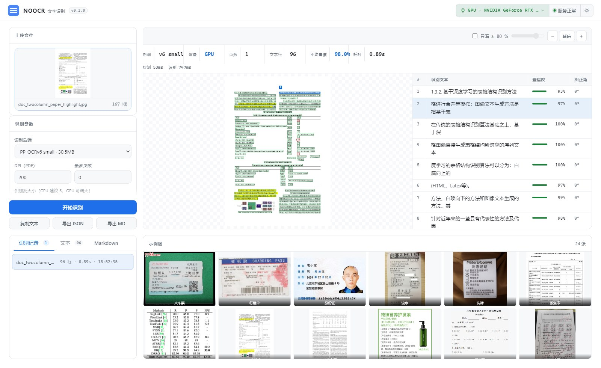

# NOOCR

[简体中文](README.md) | [English](README_EN.md) | [繁體中文](README_TW.md)

ONNX 全功能 OCR 系統。一個核心，多檔後端，CPU / GPU 雙模。

```bash
pip install -r requirements.txt              # 一條命令，CPU 與 GPU 通用
python -m noocr models --get ppocrv6-tiny    # 拉權重（約 6MB）
python -m noocr 發票.jpg                      # 辨識
python -m noocr serve                         # Web 介面 http://127.0.0.1:8000
```

有 NVIDIA 顯示卡時加 `-d cuda`（或 `serve --device cuda`），端到端快 **20-40 倍**。

遇到問題先看 [Q&A.md](Q&A.md)。

## 特性

| | |
|---|---|
| **一份依賴** | CPU 與 NVIDIA 機器裝同一個 `requirements.txt`，無需重建環境 |
| **CPU / GPU 雙模** | 同一份程式碼，`--device cpu` 或 `--device cuda`，預設自動探測 |
| **三檔後端** | PP-OCRv6 tiny（6MB）/ small（32MB，預設）/ v5（16MB） |
| **多格式輸入** | 圖片、PDF、Word、Excel、PPT、URL |
| **結果可重現** | 辨識輸出與 `rec_batch_size` 無關 |
| **四種交付** | 函式庫 / CLI / REST API / Web 介面 |
| **統一契約** | 任何後端都回傳 `OCRResult`，呼叫端無需分支 |

## 安裝

要求 Python ≥ 3.10。

```bash
git clone https://github.com/ITerydh/NOOCR.git
cd noocr
python -m venv .venv && . .venv/Scripts/activate    # Windows
# python3 -m venv .venv && source .venv/bin/activate   # Linux/macOS

pip install -r requirements.txt
```

無 NVIDIA 顯示卡的機器裝同一份依賴也能正常安裝執行，只是 GPU 部分永不啟用。若只跑 CPU 且在意安裝體積，可換輕量版（辨識結果完全一致）：

```bash
pip install -r requirements-cpu.txt     # 約 15MB
```

### GPU 需要額外的系統函式庫

CUDA 與 cuDNN 是系統層執行庫，pip 裝不了，須分別安裝：NVIDIA 驅動程式（≥ 525）、CUDA 12.x、**cuDNN 9**。

裝完告訴專案 DLL 在哪（Windows 必填，Linux/macOS 一般不需要）：

```bash
set NOOCR_GPU_LIB_DIR=D:\libs\cudnn9\bin            # Windows
export NOOCR_GPU_LIB_DIR=/usr/local/cudnn/lib       # Linux
```

專案也會自動在專案根目錄、虛擬環境的 `site-packages/cudnn/` 等常見位置尋找。仍無法啟用時的排查見 [Q&A.md](Q&A.md#gpu-未生效)。

## 取得權重

全部 17 個權重（95.8MB）託管在 ModelScope：**[iterhui/noocr-onnx](https://www.modelscope.cn/models/iterhui/noocr-onnx)**，按後端按需下載：

```bash
python -m noocr models                     # 查看各後端狀態
python -m noocr models --get ppocrv6-tiny  # 6.1MB，最快
python -m noocr models --get ppocrv6-small # 30.5MB，預設
python -m noocr models --get ppocrv5       # 15.6MB
```

或一次拉全部：

```bash
pip install modelscope
modelscope download --model iterhui/noocr-onnx --local_dir ./models
```

下載後目錄結構必須如下（`models.py` 依此路徑解析）：

```
<專案根目錄>/
├─ noocr/
└─ models/
   ├─ ppocrv6/
   │  ├─ det/
   │  │  ├─ PP-OCRv6_det_tiny.onnx      # tiny 檔
   │  │  └─ PP-OCRv6_det_small.onnx     # small 檔
   │  ├─ rec/
   │  │  ├─ PP-OCRv6_rec_tiny.onnx
   │  │  └─ PP-OCRv6_rec_small.onnx
   │  ├─ cls/
   │  │  └─ cls.onnx                    # 方向分類器（180° 糾正）
   │  ├─ ppocrv6_tiny_dict.txt          # tiny 字典（6906 類）
   │  └─ ppocrv6_dict.txt               # small 字典（18710 類）
   └─ ppocrv5/
      ├─ det/det.onnx
      ├─ rec/rec.onnx
      ├─ cls/cls.onnx
      └─ ppocrv5_dict.txt               # 6623 類
```

可選後端（`--get plate` / `orientation` / `layout` / `table`）對應：

```
models/license_plate/{car_plate_detect.onnx, plate_rec.onnx}
models/orientation/rapid_orientation.onnx
models/layout/{layout_cdla.onnx, layout_publaynet.onnx}
models/table/slanet-plus.onnx
```

手動放置時，缺哪個檔案 `python -m noocr models` 會用 `缺失` 標出。想放到別處，設 `NOOCR_MODELS_DIR`。

## 命令列

```bash
noocr <檔案>                     # 印出文字
noocr <檔案> -o out.json        # 結構化 JSON（含座標與信賴度）
noocr 論文.pdf -o 論文.md -f md  # PDF 轉 Markdown
noocr bench 試卷.jpg             # 分階段耗時剖析
noocr backends                   # 列出後端
noocr models                     # 權重狀態
noocr serve --port 8000          # Web 介面 + API
```

常用選項：`-b/--backend` 選後端、`-f/--format` 選 `json|text|md`、`-d/--device` 選 `auto|cpu|cuda`、`--batch` 調批次大小、`--no-cls` 關閉 180° 糾正。

## 當作函式庫使用

```python
from noocr import ocr

result = ocr("掃描件.jpg")
print(result.text)
print(result.to_markdown())

for line in result.all_lines:
    print(f"{line.confidence:.2f}  {line.text}  {line.box.points}")
```

指定後端與參數：

```python
# 按次覆寫：這一次用 CPU / 換後端，不影響其他呼叫
r = ocr("掃描件.jpg", device="cpu")        # 強制 CPU
r = ocr("掃描件.jpg", backend="ppocrv5")   # 暫時換後端
r = ocr("掃描件.jpg", dpi=300, max_pages=5)

# 固定設定：長駐服務應該自己持有一個實例，模型只載入一次
from noocr import OCRPipeline

pipe = OCRPipeline(backend="ppocrv6-tiny", device="cuda", rec_batch_size=8)
for path in paths:
    print(pipe(path).text)
```

## Web 介面與 API

```bash
noocr serve --host 0.0.0.0 --port 8000 --device cuda
```

介面 `http://127.0.0.1:8000/` —— 左側上傳與參數、右側圖文對照雙欄連動、下方辨識記錄與範例圖。頂欄裝置徽標可直接點擊切換 CPU / GPU，無需重啟。API 文件 `http://127.0.0.1:8000/docs`。

<details open>
<summary><b>介面圖例</b>（點擊展開）</summary>

**圖文對照雙欄** —— 左側上傳與參數，右側原圖帶識別框與識別文字雙欄連動，下方為辨識記錄與範例圖。頂欄裝置徽標顯示目前實際生效的裝置。



**明細連動** —— 點明細表任一行，圖上對應文字框高亮為藍色，其餘保持綠色。



</details>

| 方法 | 路徑 | 說明 |
|---|---|---|
| `GET` | `/health` | 健康檢查 |
| `GET` | `/api/backends` | 可用後端列表 |
| `GET` | `/api/device` | 裝置偏好與**實際生效**的裝置 |
| `POST` | `/api/device` | 切換裝置（`auto`/`cpu`/`cuda`） |
| `POST` | `/api/ocr` | 上傳檔案辨識（multipart） |
| `POST` | `/api/ocr/path?path=...` | 辨識伺服器本機路徑 |
| `GET` | `/api/page/{doc_id}/{i}` | 取第 i 頁算繪圖（多頁翻頁用） |
| `POST` | `/api/warmup` | 預載入後端 |

```bash
curl -X POST http://127.0.0.1:8000/api/ocr \
  -F "file=@發票.jpg" -F "backend=ppocrv6-tiny"
```

## 效能

RTX 4070 Ti SUPER + ppocrv6-small，同一批範例圖取中位數：

| 圖片 | 行數 | CPU | GPU | 加速比 |
|---|---|---|---|---|
| 票據 | 19 | 15537 ms | **594 ms** | 26x |
| 銀行流水 | 30 | 13040 ms | **577 ms** | 23x |
| 化驗單 | 69 | 10396 ms | **567 ms** | 18x |
| 身分證 | 11 | 13317 ms | **400 ms** | 33x |
| 銀行網點 | 4 | 9414 ms | **249 ms** | 38x |

GPU 側首次請求含約 2.4s 的模型載入與 CUDA kernel 編譯，之後穩定在 0.25-0.6s。重現：

```bash
python scripts/perf/bench_device.py cpu     # CPU 基線
python scripts/perf/bench_device.py cuda    # GPU 基線
```

## 後端對比

| 後端 | 體積 | 相對速度 | 加權信賴度 | 適用 |
|---|---|---|---|---|
| `ppocrv6-tiny` | 6.1MB | **0.58x** | 0.961 | 邊緣裝置、批次 |
| `ppocrv6-small` | 30.5MB | 1.73x | **0.971** | 預設 |
| `ppocrv5` | 15.6MB | 1.00x | 0.936 | 相容舊專案 |

## 專案結構

```
noocr/
├─ types.py              統一資料模型（Pydantic）
├─ models.py             權重清單與下載
├─ cli.py                命令列
├─ engine/               推論引擎
│  ├─ session.py           session 快取、裝置探測、GPU 執行庫掛載
│  ├─ imageops.py          影像幾何與預處理
│  └─ base.py              後端抽象
├─ backends/             OCR 後端
│  ├─ ppocr.py             PP-OCRv5
│  ├─ ppocrv6.py           PP-OCRv6
│  ├─ postprocess.py       DB 偵測後處理
│  └─ decode.py            CTC 解碼
├─ inputs/loader.py      多格式輸入
├─ document/             文件結構化
├─ pipeline/             編排
└─ web/                  Web 介面與 API
    ├─ app.py
    └─ templates/index.html
tests/                   測試與基準
scripts/
├─ publish_weights.py      權重發布腳本
├─ perf/                   效能基準與 A/B 腳本
└─ models_repo_card.md     權重倉庫模型卡
```

## 致謝

本專案在建構過程中受益於以下開源專案，感謝原作者與社群：

- **[OnnxOCR](https://github.com/jingsongliujing/OnnxOCR)** —— ONNX 推論鏈路、模型匯出與文件結構化思路，本專案的起點。
- **[PaddleOCR](https://github.com/PaddlePaddle/PaddleOCR)** —— PP-OCR 系列模型與演算法設計，本專案三檔後端的權重皆來自此專案。
- **[DeepSeek-AI](https://github.com/deepseek-ai/DeepSeek-OCR)** —— OCR 精度最佳化的思路參考。

若上述專案的成果對你的工作有所幫助，請優先支持它們。

## 授權

程式碼 Apache-2.0。權重源自 [PaddleOCR](https://github.com/PaddlePaddle/PaddleOCR)（Apache-2.0），依原授權條款使用。
